  

# 👋 Hi, I'm Vedansh Kumar

**B.Tech CSE-AIML Student | Software Developer | AI/ML Enthusiast**

I’m a Computer Science student passionate about building practical software solutions, exploring Artificial Intelligence & Machine Learning, and strengthening my problem-solving skills through Data Structures & Algorithms.

---

## 🛠️ Currently Learning & Working With

**Programming & Problem Solving**

* C++
* Python
* Data Structures & Algorithms

**Web Development**

* HTML5 • CSS3 • JavaScript
* Flask • FastAPI
* MERN Stack

**AI & Machine Learning**

* Machine Learning
* Data Analysis
* Computer Vision
* AI-powered applications

**Databases & Tools**

* MySQL • PostgreSQL • SQLite
* Git • GitHub
* REST APIs

---

## 📊 GitHub Stats

---

## 🚀 Featured Projects

### 🏥 PhysioCare — Hospital Management Website

A complete physiotherapy and hospital management platform designed to streamline patient management and healthcare operations.

**Key Features:**

* Patient management
* Doctor & therapist management
* Appointment scheduling
* Treatment & therapy records
* Patient dashboard
* Admin management
* Responsive healthcare interface
* Database-driven backend

**Tech Stack:** HTML • CSS • JavaScript • Flask • PostgreSQL

---

### 🎯 HabitNexus — Advanced Habit Tracker & Student Productivity Platform

An advanced habit-tracking and productivity platform designed specifically for students to build consistency, monitor progress, and develop better daily routines.

**Key Features:**

* Habit creation & tracking
* Daily routine management
* Streak tracking
* Progress visualization
* Student-focused productivity tools
* Push-up / fitness tracking
* Challenges & achievements
* Leaderboards
* Responsive UI

**Tech Stack:** HTML • CSS • JavaScript • Flask • PostgreSQL

---

### 🏆 Routine Battle — Habit & Challenge Platform

A daily routine and habit-tracking application that turns consistency into a challenge through streaks, friend challenges, leaderboards, and progress tracking.

**Key Features:**

* Daily routine management
* Calendar-based tracking
* Streak system
* Weekly progress charts
* Friend challenges
* Leaderboards
* CSV data export
* Mobile-responsive interface

---

### 🧘 CHANTIQ — AI Repetition Intelligence System

An AI-powered repetition intelligence system designed to detect and count chanting or repeated speech using speech-recognition technologies.

**Focus:** AI • Speech Recognition • Audio Processing

---

### 🏥 QueueRator — QR Queue Management System

A QR-based queue management solution designed to simplify queue handling and reduce waiting time for patients and customers.

**Focus:** QR Technology • Queue Management • Web Development

---

## 📅 Contribution Activity

---

## 📈 Profile Activity

My GitHub statistics and contribution graphics are automatically generated from my GitHub activity and refreshed using GitHub Actions.

---

## 🤝 Let's Connect

* GitHub: [@KumarVedansh12](https://github.com/KumarVedansh12)
* LinkedIn: Add your LinkedIn profile here

---

  <i>Building. Learning. Improving. Every day.</i>

